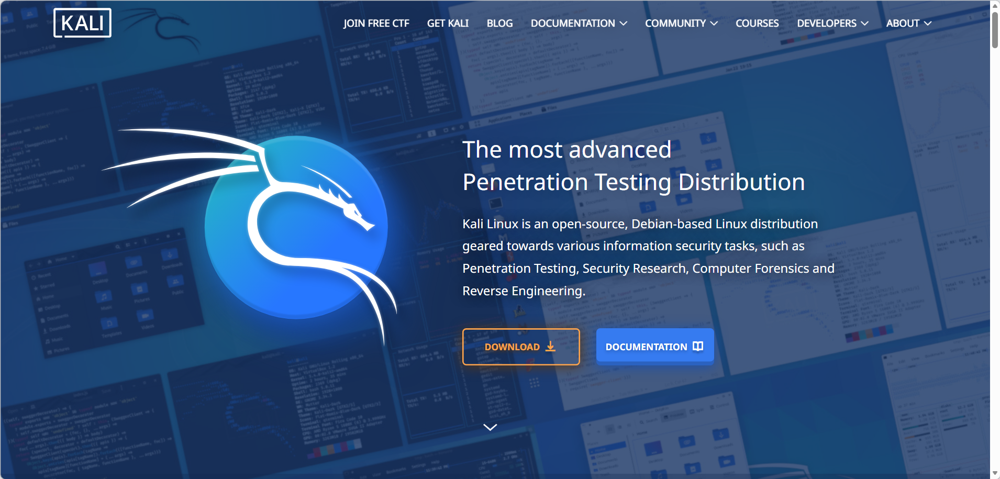
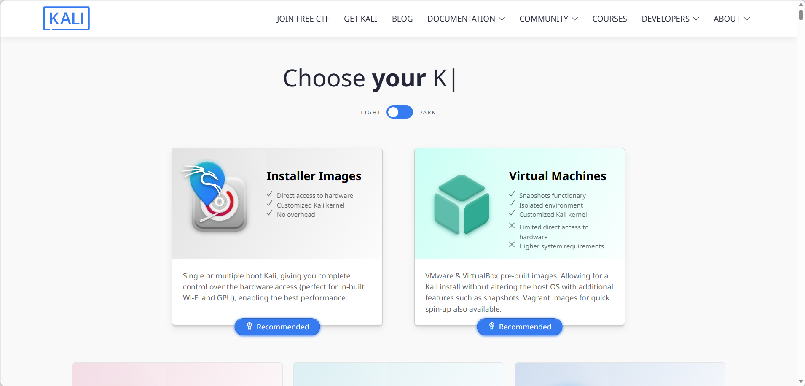
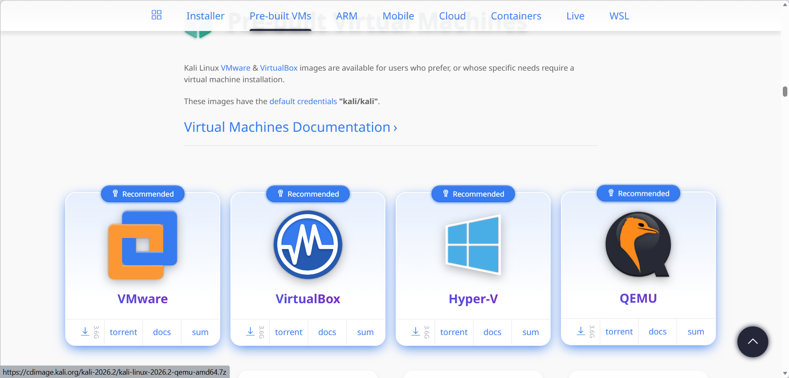
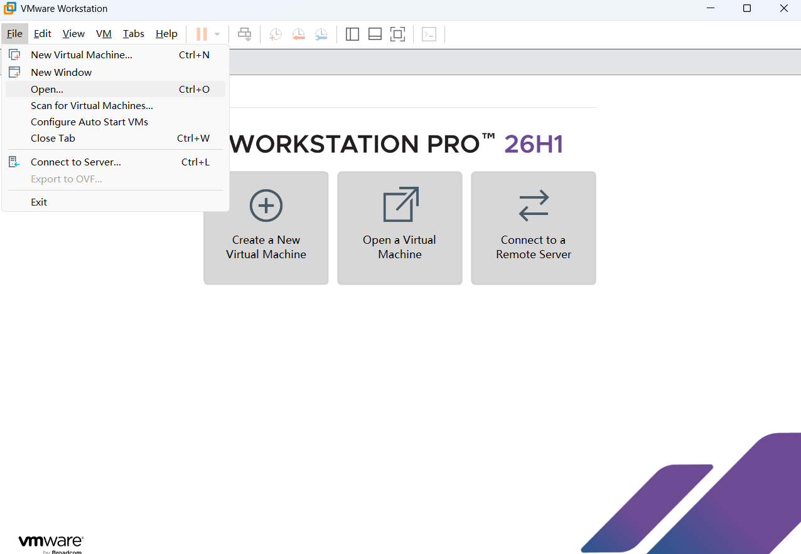
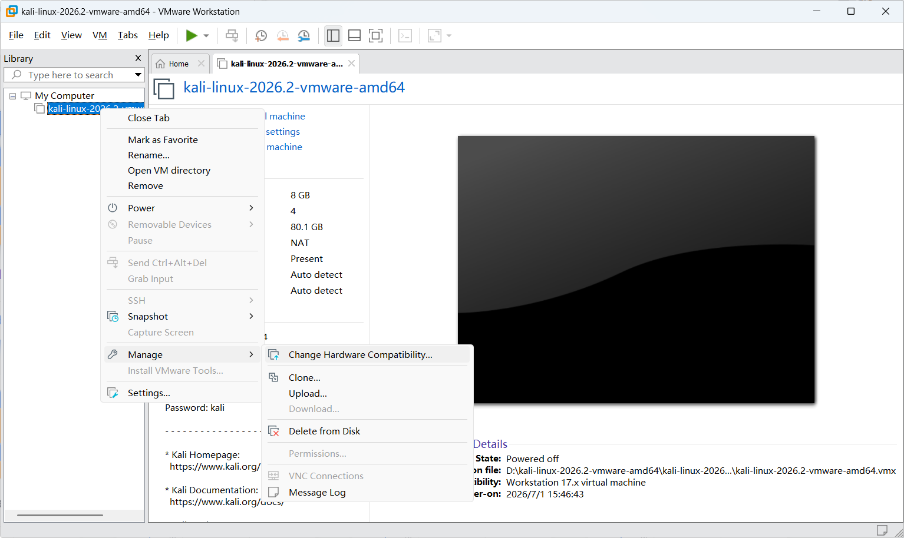
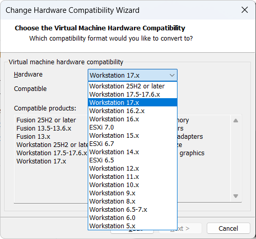
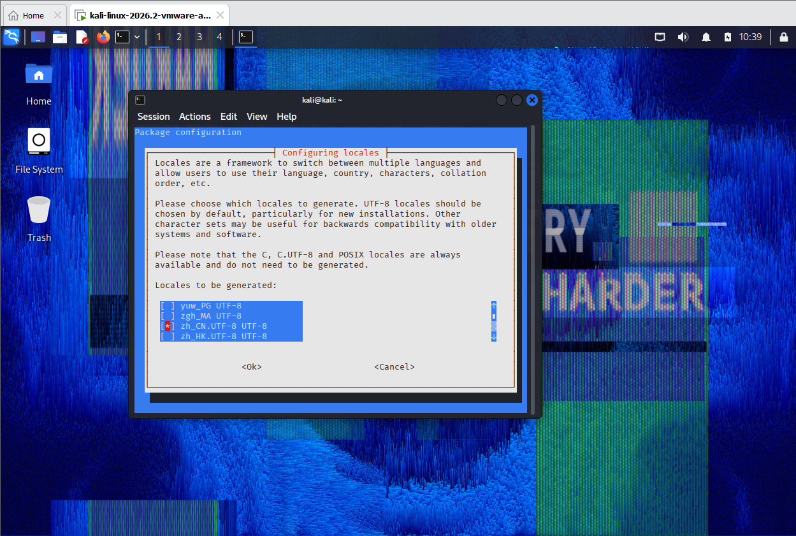
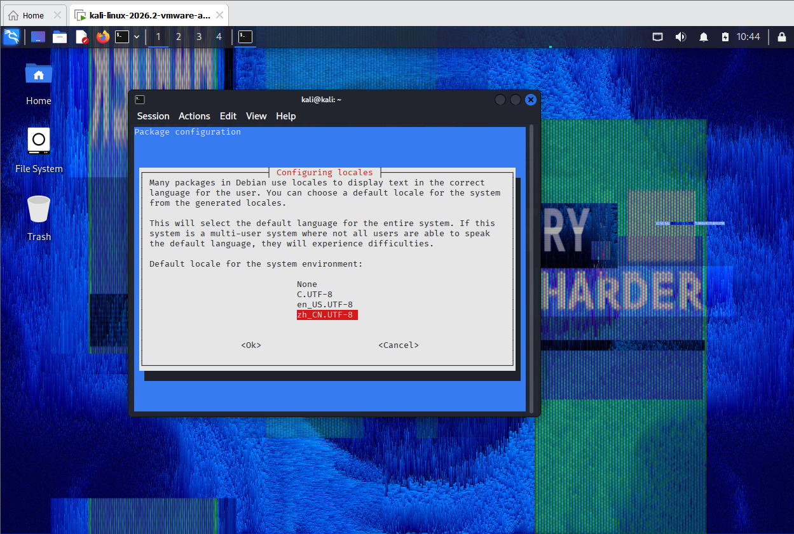
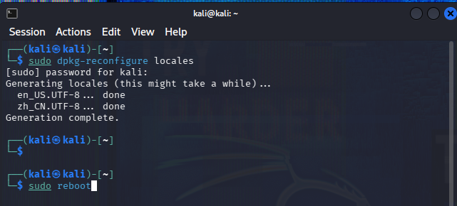
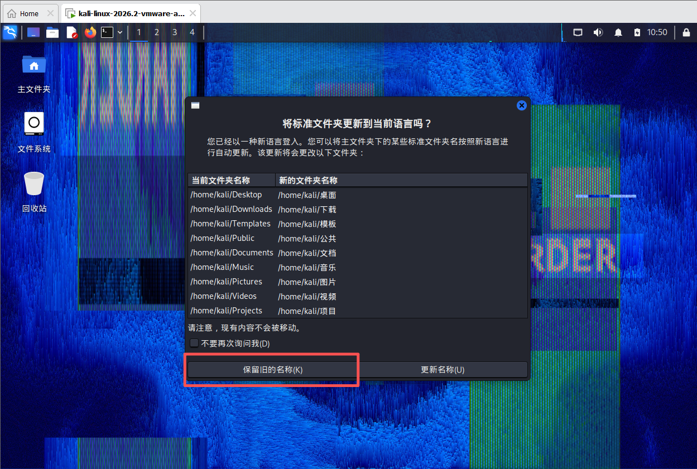

#### 1、下载

打开官网 [Kali Linux | Penetration Testing and Ethical Hacking Linux Distribution](https://www.kali.org/)



点击 **DOWNLOAD**

会有两种形式，左边 **installer images** 是下载 .iso 的镜像文件，右边 **virtual machines** 是虚拟机本体压缩包。



这里以下载右边虚拟机为例



选择对应的虚拟机（这里以 VMware 为例），点击下载图标开始下载。

下载好后解压。

#### 2、安装

打开 VMware，选择 File，点击 Open



进入到解压后的文件夹，选择后缀 `.vmx` 的文件打开。

调整好文件位置、CPU、内存大小，然后打开。

账号密码：`kali/kali`

#### 3、解决没有鼠标光标

可能会出现没有鼠标光标的问题。

需要先关闭 Kali，右键 Kali 虚拟机 → manage → change hardware compatibility



点击 next，将 Hardware 栏换成 **workstation 17.x**



重新启动 Kali，光标就回来了。

#### 4、汉化教程

打开命令行输入命令

```
sudo dpkg-reconfigure locales
```

输入密码跳转到以下页面，滚轮或者下键往下翻找到中文 `zh_CN`，按空格选中，会出现星号代表已选中，回车。



再选择 **zh_CN**，回车。



完成后重启



输入账密后进入桌面会弹出操作框，选择**保留旧的名称**。



汉化完成。
