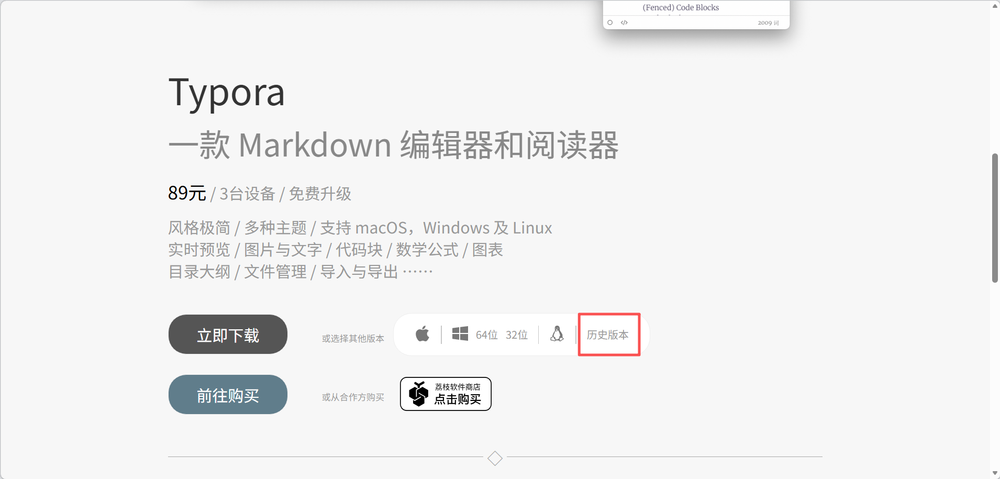
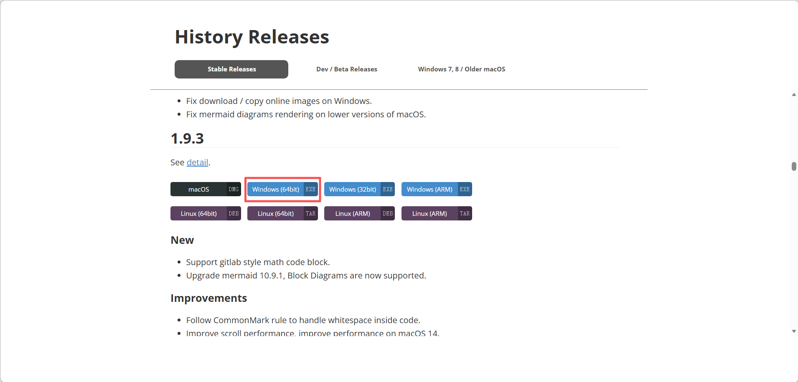
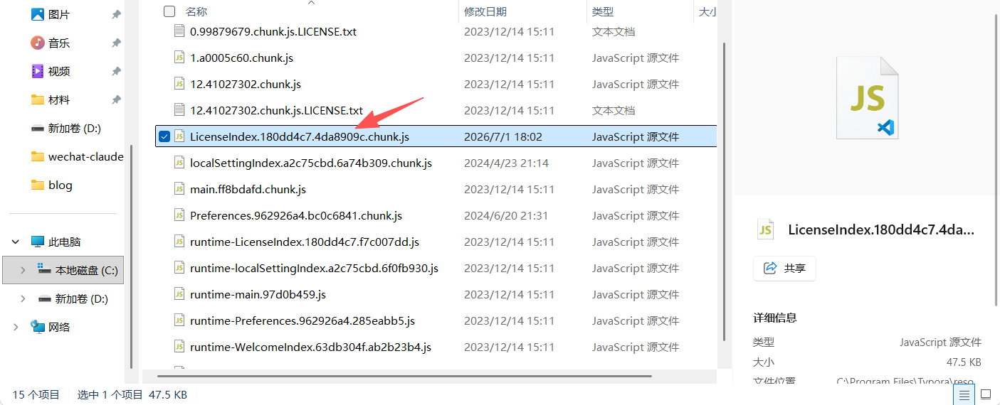
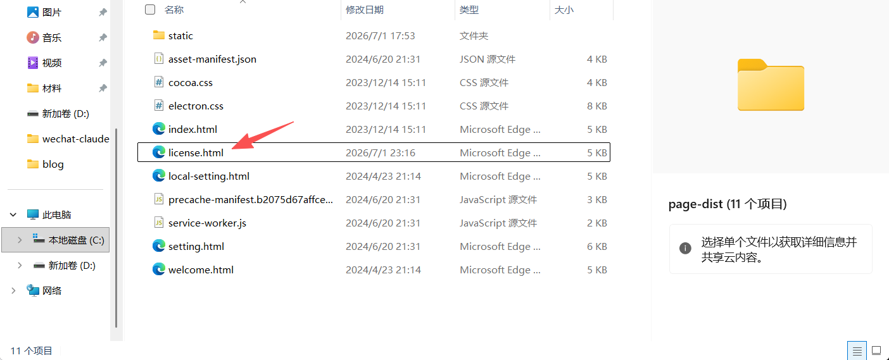

> ⚠️ **注意：** 该方法仅适用于 1.10 以下版本

#### 1、下载正版Typora

打开 Typora 官网 https://typoraio.cn/，选择**历史版本**



往下找到 **1.9.3** 下载



下好后启动安装程序，按照提示正常安装，记住安装路径。

#### 2、激活

安装后打开文件目录，你的路径不一定是这个！

```
C:\Program Files\Typora\resources\page-dist\static\js
```

用文本编辑器打开这个文件



Ctrl+F 查找：

```
e.hasActivated="true"==e.hasActivated
```

替换成：

```
e.hasActivated="true"=="true"
```

保存后启动 Typora，提示已激活。

#### 3、自动关闭已激活弹窗

在安装目录中找到文件 **license.html**

```
C:\Program Files\Typora\resources\page-dist
```



用文本编辑器打开，Ctrl+F 查找：

```
</body></html>
```

替换成：

```
</body><script>window.onload=function(){setTimeout(()=>{window.close();},500);}</script></html>
```

保存后重启 Typora，弹窗激活 500ms 后会自动关闭，如果报错可增加时间。
